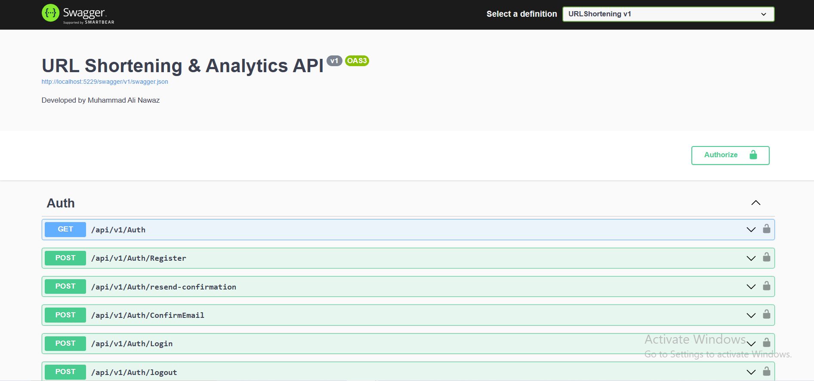
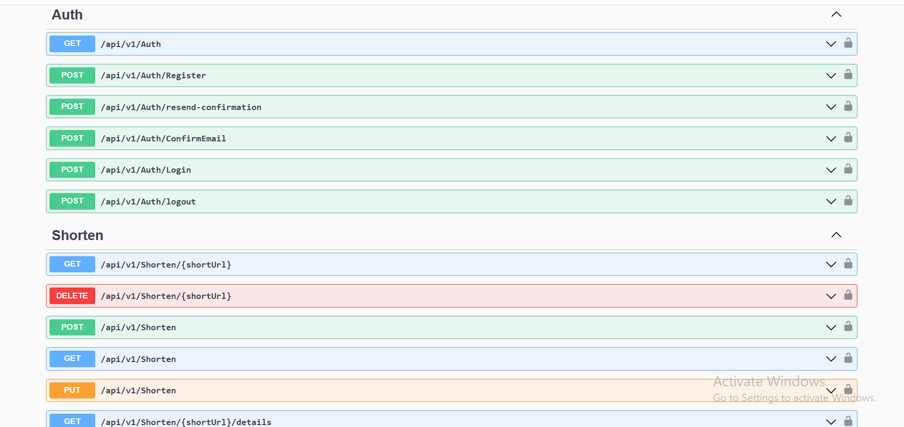

<h1 align="center">🔗 URL Shortening & Analytics API</h1>

<p align="center">
  <b>An authenticated URL shortener and traffic analytics REST API built with ASP.NET Core 8, Entity Framework Core, SQL Server, ASP.NET Core Identity, JWT authentication, rate limiting, Swagger, and xUnit.</b>
</p>

<p align="center">
  
  
  
  
  
  
  
</p>

---

## 📸 Project Screenshots

| Swagger API Documentation | URL Shortening Endpoints |
|---|---|
|  |  |

---

## 🚀 Project Overview

**URL Shortening & Analytics API** is an API-only backend for generating short links, redirecting visitors, managing user-owned links, and analyzing traffic.

Users can register, confirm their email, log in, create manageable short links, regenerate short codes, configure expiration, reactivate links, delete links, and review analytics. Anonymous users can also create public short links, but anonymous links are intentionally unmanaged.

The application records redirect events and reports useful analytics such as unique IP counts, referrers, browsers, operating systems, device types, and approximate locations. It also includes endpoint rate limiting, secure local configuration through .NET User Secrets, trusted forwarded-header processing, resilient geolocation calls, SQL Server migrations, Swagger/OpenAPI, and a verified xUnit test suite.

---

## 🎯 Project Purpose

This project demonstrates practical ASP.NET Core backend development with authentication, ownership authorization, persistence, validation, external HTTP integration, caching, abuse protection, and automated testing.

It showcases:

- ASP.NET Core 8 Web API development
- Versioned REST endpoint design
- SQL Server persistence with Entity Framework Core
- ASP.NET Core Identity user management
- JWT Bearer authentication
- Email-confirmation workflow with expiring hashed codes
- Security-stamp token revocation on logout
- User-owned URL management
- Public redirects with access-event logging
- Browser, device, operating-system, referrer, IP, and location analytics
- In-memory geolocation caching
- ASP.NET Core fixed-window rate limiting
- Trusted proxy and forwarded-header handling
- Swagger/OpenAPI documentation
- EF Core migrations
- xUnit controller and helper tests
- Secret-safe local configuration with .NET User Secrets

---

## ⭐ Key Highlights

- 🔗 Eight-character Nanoid short-code generation with collision retries
- 🌐 Public URL redirects through HTTP `302 Found`
- 👤 Authenticated ownership for link management and analytics
- 🕶️ Optional anonymous link creation with stricter rate limits
- ⏳ Link expiration and owner-controlled reactivation
- 📊 Access logs and grouped traffic analytics
- 🧭 Resilient IP geolocation through a typed `HttpClient`
- ⚡ In-memory caching for successful and failed geolocation lookups
- ✉️ Six-digit email-confirmation codes stored only as HMAC hashes
- 🔐 Configurable short-lived JWT access tokens
- 🚪 Logout invalidation through ASP.NET Identity security-stamp rotation
- 🛡️ Endpoint rate limiting with user/IP partitioning
- 🔒 Trusted forwarded-header processing instead of directly trusting raw headers
- 🗃️ Four verified Entity Framework Core migrations
- 🧪 26 passing xUnit tests
- 📘 Swagger/OpenAPI documentation with Bearer-token authorization
- 🔑 Local secrets stored outside the repository

---

## ✨ Features

### 🔐 Authentication & Email Confirmation

| Feature | Description |
|---|---|
| Registration | Creates an ASP.NET Identity user account |
| Confirmation Code | Generates a random six-digit code and emails it through SMTP |
| Secure Code Storage | Stores only an HMAC-SHA256 confirmation-code hash |
| Code Expiration | Confirmation codes expire after a configurable period |
| Resend Confirmation | Sends a fresh code for an existing unconfirmed account |
| Login | Issues a JWT only after the email address is confirmed |
| JWT Validation | Validates issuer, audience, signature, expiry, and required claims |
| Revocation Check | Validates the current Identity security stamp on authenticated requests |
| Logout | Rotates the security stamp and invalidates previously issued tokens |

### 🔗 URL Management

| Feature | Description |
|---|---|
| Create Short Link | Creates an eight-character short code for a valid destination URL |
| Anonymous Creation | Allows limited public creation of intentionally unmanaged links |
| Authenticated Creation | Associates the short link with the authenticated user |
| Public Redirect | Redirects an active short code to its destination |
| List Owned Links | Returns only the authenticated user's URLs |
| Link Details | Returns one owned link by short code |
| Regenerate Short Code | Generates a new unique short code for an owned link |
| Configure Expiration | Adds or updates a link-expiration date |
| Reactivate Link | Removes expiration from an owned link |
| Delete Link | Deletes an owned short link |
| Ownership Isolation | Another user's link is not exposed through management endpoints |
| Duplicate Destinations | Different users can shorten the same destination URL |

### 📊 Analytics

| Feature | Description |
|---|---|
| Access Logging | Records redirect time, processed IP, referrer, and User-Agent |
| Summary Statistics | Reports total visits, unique IPs, and last-access information |
| Referrer Analytics | Groups traffic by referrer host |
| Browser Analytics | Detects and groups browser families |
| OS Analytics | Detects and groups operating systems |
| Device Analytics | Groups visitors by device type |
| Location Analytics | Resolves public IP addresses to approximate locations |
| Access Log History | Returns the owner's ordered access-log records |
| Top URLs | Returns the five most frequently accessed owned URLs |
| Failure Resilience | Analytics continue when the geolocation provider is unavailable |

### 🛡️ Reliability & Abuse Protection

| Area | Implementation |
|---|---|
| Authentication Limits | Fixed-window limits for registration, confirmation, login, and logout |
| Creation Limits | Separate limits for anonymous and authenticated link creation |
| Redirect Limits | Public redirects have their own rate-limit policy |
| Analytics Limits | Analytics and access logs use a dedicated policy |
| Proxy Trust | Only configured proxies can supply forwarded IP information |
| Error Handling | Global safe problem responses prevent raw exception details from reaching clients |
| Validation | DTO validation enforces email, password, URL, short-code, and length rules |
| Short-Code Uniqueness | Application collision checks plus a unique SQL Server index |

---

## 🛠 Technology Stack

| Layer | Technologies |
|---|---|
| Runtime | .NET 8 |
| Backend | ASP.NET Core 8 Web API, C# |
| Authentication | ASP.NET Core Identity, JWT Bearer |
| ORM | Entity Framework Core 8.0.11 |
| Database | Microsoft SQL Server |
| Mapping | AutoMapper 13.0.1 |
| Short-Code Generation | Nanoid 3.1.0 |
| Device Detection | DeviceDetector.NET 6.4.2 |
| Email | MailKit 4.9.0 |
| External HTTP | Typed `HttpClient` |
| Caching | ASP.NET Core in-memory cache |
| Rate Limiting | ASP.NET Core Rate Limiting middleware |
| API Versioning | Microsoft ASP.NET Core MVC Versioning |
| Documentation | Swagger / Swashbuckle |
| Testing | xUnit 2.9.2, Microsoft.NET.Test.Sdk 17.11.1 |
| EF CLI | Repository-local `dotnet-ef` 8.0.11 tool manifest |

---

## 🏗 Architecture Overview

The backend follows a layered structure that separates HTTP concerns, supporting logic, persistence, and external integrations.

```text
Swagger / API Client
        ↓
ASP.NET Core Controllers
        ↓
Helpers and Application Services
        ↓
Repository Interfaces
        ↓
Entity Framework Core Repositories
        ↓
SQL Server Database
```

Supporting traffic analytics flow:

```text
Public redirect request
        ↓
Short-code lookup and expiry validation
        ↓
Access-event persistence
        ↓
Temporary redirect response
        ↓
Authenticated analytics queries
        ↓
Device detection + cached geolocation grouping
```

### Layer Responsibilities

| Layer | Responsibility |
|---|---|
| `Controllers` | Routing, authorization, validation, rate-limit policies, ownership checks, and HTTP responses |
| `Helpers` | User operations, short-code support, device parsing, confirmation-code security, and geolocation |
| `Services` | SMTP email delivery |
| `Repositories` | Entity Framework Core data access and persistence |
| `Data` | Identity user, URL, access-log entities, `DataContext`, and migrations |
| `DTOs` | Validated request and response contracts |
| `AutoMapper` | Entity-to-response mappings |
| `URLShortening.Tests` | Controller, model, confirmation-code, and geolocation verification |

---

## 📁 Repository Structure

```text
aspnet-url-shortener-analytics-api/
├── docs/
│   └── screenshots/
│       ├── api.png
│       └── swagger.png
├── URLShortening/
│   ├── .config/
│   │   └── dotnet-tools.json
│   ├── URLShortening/
│   │   ├── AutoMapper/
│   │   ├── Controllers/
│   │   ├── Data/
│   │   │   ├── Migrations/
│   │   │   └── Repository/
│   │   ├── DTOs/
│   │   ├── Helpers/
│   │   ├── Models/
│   │   ├── Properties/
│   │   ├── Services/
│   │   ├── appsettings.json
│   │   ├── appsettings.Development.json
│   │   ├── appsettings.example.json
│   │   ├── Program.cs
│   │   ├── URLShortening.csproj
│   │   └── URLShortening.http
│   ├── URLShortening.Tests/
│   └── URLShorteningService.sln
├── .gitignore
├── LICENSE
└── README.md
```

> Generated `bin`, `obj`, test-result, coverage, local database, log, `.env`, and user-specific IDE files must remain untracked.

---

## 🗃 Database Model

A verified local migration created **10 SQL Server tables**.

| Table | Purpose |
|---|---|
| `AspNetUsers` | Stores Identity users, password hashes, confirmation-code hash, expiry, and security stamps |
| `AspNetRoles` | Stores Identity roles |
| `AspNetUserRoles` | Maps users to roles |
| `AspNetUserClaims` | Stores user claims |
| `AspNetRoleClaims` | Stores role claims |
| `AspNetUserLogins` | Stores external-login metadata |
| `AspNetUserTokens` | Stores Identity token-provider data |
| `Urls` | Stores destinations, unique short codes, ownership, timestamps, and expiration |
| `AccessLogs` | Stores redirect events linked to URLs |
| `__EFMigrationsHistory` | Tracks applied Entity Framework Core migrations |

### Relationships

```text
AspNetUsers 1 ──────── * Urls
Urls        1 ──────── * AccessLogs
```

### Applied Migrations

```text
20241224151251_initial
20241225133921_AddNullableProperties
20260715120000_RemoveUniqueLongUrlIndex
20260716120000_AddEmailConfirmationCodeExpiry
```

The current model permits duplicate destination URLs while enforcing global short-code uniqueness.

---

## 🔄 Application Flows

### Registration & Confirmation

```text
Client submits email and password
        ↓
ASP.NET Identity creates the user
        ↓
Random six-digit confirmation code is generated
        ↓
Only an HMAC hash and expiry are stored
        ↓
Plain code is delivered through SMTP
        ↓
Client submits email and confirmation code
        ↓
Hash and expiry are validated
        ↓
Identity email confirmation is completed
```

### Login & Logout

```text
Confirmed user submits credentials
        ↓
Identity password validation succeeds
        ↓
JWT is issued with user ID, email, JTI, and security-stamp claims
        ↓
JWT middleware validates the token on protected requests
        ↓
Logout rotates the Identity security stamp
        ↓
Previously issued JWTs fail the security-stamp check
```

### Link Creation & Redirect

```text
Client submits a destination URL
        ↓
DTO validation checks syntax and maximum length
        ↓
Nanoid generates an eight-character candidate
        ↓
Repository verifies short-code uniqueness
        ↓
URL is stored with optional user ownership and expiry
        ↓
Visitor requests the public short URL
        ↓
API records an access event
        ↓
API returns HTTP 302 to the destination
```

---

## 🔌 API Endpoints

Base route:

```text
/api/v1
```

### Authentication

| Method | Endpoint | Authentication | Purpose |
|---|---|---|---|
| `GET` | `/api/v1/auth` | Public | Health check for the authentication controller |
| `POST` | `/api/v1/auth/register` | Public | Register an account and send a confirmation code |
| `POST` | `/api/v1/auth/resend-confirmation` | Public | Send a fresh code to an unconfirmed account |
| `POST` | `/api/v1/auth/confirmemail` | Public | Confirm the email address using the six-digit code |
| `POST` | `/api/v1/auth/login` | Public | Log in and receive a JWT access token |
| `POST` | `/api/v1/auth/logout` | Bearer token | Rotate the security stamp and invalidate issued tokens |

### Short Links

| Method | Endpoint | Authentication | Purpose |
|---|---|---|---|
| `POST` | `/api/v1/shorten` | Optional | Create an anonymous or user-owned short link |
| `GET` | `/api/v1/shorten/{shortCode}` | Public | Redirect to an active destination and record access |
| `GET` | `/api/v1/shorten` | Bearer token | List the authenticated user's links |
| `GET` | `/api/v1/shorten/{shortCode}/details` | Bearer token | Return one owned link |
| `PUT` | `/api/v1/shorten` | Bearer token | Legacy regeneration by destination URL |
| `PUT` | `/api/v1/shorten/update` | Bearer token | Explicitly regenerate a link using its current short code |
| `PUT` | `/api/v1/shorten/expire` | Bearer token | Set or update expiration |
| `PUT` | `/api/v1/shorten/reactivate/{shortCode}` | Bearer token | Remove expiration from an owned link |
| `DELETE` | `/api/v1/shorten/{shortCode}` | Bearer token | Delete an owned link |

### Analytics

| Method | Endpoint | Authentication | Purpose |
|---|---|---|---|
| `GET` | `/api/v1/shorten/{shortCode}/stats` | Bearer token | Return grouped visit statistics |
| `GET` | `/api/v1/shorten/{shortCode}/access-logs` | Bearer token | Return ordered access events |
| `GET` | `/api/v1/shorten/topUrls` | Bearer token | Return the five most visited owned URLs |

### Documentation

| Method | Endpoint | Availability | Purpose |
|---|---|---|---|
| `GET` | `/` | Local/API | Return API status and documentation path |
| `GET` | `/swagger/index.html` | Enabled | Open Swagger UI |
| `GET` | `/swagger/v1/swagger.json` | Enabled | Return the OpenAPI document |

### Common HTTP Responses

| Status | Meaning |
|---|---|
| `200 OK` | Request completed successfully |
| `201 Created` | Short URL was created |
| `202 Accepted` | Confirmation resend request was accepted |
| `204 No Content` | Logout or deletion succeeded |
| `302 Found` | Valid short link redirects to its destination |
| `400 Bad Request` | Validation, credentials, code, or update request failed |
| `401 Unauthorized` | Authentication is missing or invalid |
| `404 Not Found` | Link/user is missing, expired, or not owned by the requester |
| `409 Conflict` | Duplicate confirmed account or ambiguous legacy URL update |
| `429 Too Many Requests` | A rate-limit policy was exceeded |
| `503 Service Unavailable` | Confirmation email delivery failed |

---

## 🔐 Security & Reliability

| Area | Implementation |
|---|---|
| Passwords | Managed and hashed by ASP.NET Core Identity |
| Confirmation Codes | HMAC-SHA256 hash stored instead of the plaintext code |
| Code Lifetime | Configurable and clamped to a safe range |
| Access Tokens | Signed JWTs with configurable short lifetime |
| JWT Claims | User ID, email, JTI, and current security stamp |
| Logout Revocation | Security-stamp rotation invalidates existing JWTs |
| Ownership | User identity is read from authenticated claims, not request-supplied IDs |
| Identifier Probing | Missing and non-owned links both return `404 Not Found` |
| Short Codes | Collision retry plus a unique database index |
| URL Length | Maximum 450 characters matches SQL Server storage |
| Forwarded Headers | Raw proxy headers are not trusted directly by controllers |
| Rate Limiting | Auth, creation, redirect, and analytics operations use separate policies |
| External Provider Failure | Geolocation failures return unknown data instead of failing analytics |
| Error Responses | Global handler returns safe problem details without stack traces or connection strings |
| Secrets | Database, JWT, confirmation, and SMTP secrets remain outside Git |
| Tests | 26 tests verify security, ownership, redirect, analytics, and failure behavior |

> This is a portfolio-grade backend, not an internet-scale hosted shortener. A production deployment should add centralized secret management, distributed rate limiting, distributed caching, monitoring, audit logs, backups, dependency patching, and an operational security review.

---

## ⚙️ Installation Guide — Windows PowerShell

### Requirements

- Windows 10 or Windows 11
- PowerShell 5.1 or PowerShell 7+
- .NET 8 SDK, or a newer SDK with the .NET 8 runtime installed
- Microsoft SQL Server, SQL Server Developer Edition, SQL Server Express, or LocalDB
- Git
- A valid SMTP account/app password to test registration emails

Verify the installed tools:

```powershell
dotnet --version
dotnet --list-runtimes
git --version
```

Confirm that the runtime list includes:

```text
Microsoft.NETCore.App 8.x.x
Microsoft.AspNetCore.App 8.x.x
```

### 1️⃣ Clone and Open the Repository

```powershell
git clone https://github.com/YOUR_GITHUB_USERNAME/aspnet-url-shortener-analytics-api.git
Set-Location '.\aspnet-url-shortener-analytics-api'

$RepoRoot = (Get-Location).Path
$SolutionRoot = Join-Path $RepoRoot 'URLShortening'
$SolutionFile = Join-Path $SolutionRoot 'URLShorteningService.sln'
$ProjectFile = Join-Path $SolutionRoot 'URLShortening\URLShortening.csproj'
$TestProject = Join-Path $SolutionRoot 'URLShortening.Tests\URLShortening.Tests.csproj'
```

### 2️⃣ Verify SQL Server

For a default SQL Server instance:

```powershell
$SqlServer = $env:COMPUTERNAME
Get-Service -Name 'MSSQLSERVER'
```

For SQL Server Express:

```powershell
$SqlServer = "$env:COMPUTERNAME\SQLEXPRESS"
```

For LocalDB:

```powershell
$SqlServer = '(localdb)\MSSQLLocalDB'
sqllocaldb start MSSQLLocalDB
```

Create the local connection string:

```powershell
$DatabaseName = 'UrlShorteningDb'
$ConnectionString = "Server=$SqlServer;Database=$DatabaseName;Trusted_Connection=True;MultipleActiveResultSets=true;TrustServerCertificate=True"
```

### 3️⃣ Restore Tools and Packages

```powershell
Set-Location -LiteralPath $SolutionRoot

dotnet restore $SolutionFile
dotnet tool restore
dotnet ef --version
```

### 4️⃣ Configure Local User Secrets

Set the development environment:

```powershell
$env:ASPNETCORE_ENVIRONMENT = 'Development'
$env:DOTNET_ENVIRONMENT = 'Development'
```

Generate cryptographically random development keys:

```powershell
function New-RandomBase64Key {
    param([int]$ByteCount = 48)

    $Bytes = New-Object byte[] $ByteCount
    $Generator = [Security.Cryptography.RandomNumberGenerator]::Create()

    try {
        $Generator.GetBytes($Bytes)
        [Convert]::ToBase64String($Bytes)
    }
    finally {
        $Generator.Dispose()
    }
}

$JwtKey = New-RandomBase64Key
$CodeKey = New-RandomBase64Key
```

Store the database and JWT configuration:

```powershell
dotnet user-secrets set `
    'ConnectionStrings:DefaultConnection' `
    $ConnectionString `
    --project $ProjectFile

dotnet user-secrets set 'JWT:Key' $JwtKey --project $ProjectFile
dotnet user-secrets set 'JWT:Issuer' 'URLShorteningApi' --project $ProjectFile
dotnet user-secrets set 'JWT:Audience' 'URLShorteningClients' --project $ProjectFile
dotnet user-secrets set 'JWT:AccessTokenMinutes' '60' --project $ProjectFile
dotnet user-secrets set 'CodeKey' $CodeKey --project $ProjectFile

Remove-Variable JwtKey, CodeKey -ErrorAction SilentlyContinue
```

Configure Gmail SMTP using a Google app password:

```powershell
$SmtpEmail = Read-Host 'Enter Gmail address'
$SecureSmtpPassword = Read-Host 'Enter Gmail app password' -AsSecureString
$PasswordPointer = [Runtime.InteropServices.Marshal]::SecureStringToBSTR($SecureSmtpPassword)

try {
    $SmtpPassword = [Runtime.InteropServices.Marshal]::PtrToStringBSTR($PasswordPointer)
}
finally {
    [Runtime.InteropServices.Marshal]::ZeroFreeBSTR($PasswordPointer)
}

dotnet user-secrets set 'EmailSettings:Email' $SmtpEmail --project $ProjectFile
dotnet user-secrets set 'EmailSettings:Password' $SmtpPassword --project $ProjectFile
dotnet user-secrets set 'EmailSettings:Smtp' 'smtp.gmail.com' --project $ProjectFile
dotnet user-secrets set 'EmailSettings:Port' '587' --project $ProjectFile
dotnet user-secrets set 'EmailSettings:DisplayName' 'URL Shortening' --project $ProjectFile

Remove-Variable SmtpEmail, SmtpPassword, SecureSmtpPassword, PasswordPointer -ErrorAction SilentlyContinue
```

Do not commit a JWT key, confirmation hashing key, SMTP password, populated `.env`, or User Secrets store.

### 5️⃣ Build the Solution

```powershell
Set-Location -LiteralPath $SolutionRoot

dotnet clean $SolutionFile --configuration Release
dotnet build $SolutionFile --configuration Release --no-restore
```

Expected result:

```text
Build succeeded.
```

### 6️⃣ Run the Automated Tests

```powershell
dotnet test `
    $SolutionFile `
    --configuration Release `
    --no-build
```

Verified result:

```text
Test summary: total: 26, failed: 0, succeeded: 26, skipped: 0
```

### 7️⃣ Apply Entity Framework Core Migrations

```powershell
dotnet ef database update `
    --project $ProjectFile `
    --startup-project $ProjectFile
```

Verify migration status:

```powershell
dotnet ef migrations list `
    --project $ProjectFile `
    --startup-project $ProjectFile
```

Applied migrations are displayed without `(Pending)`.

> Do not create a new initial migration. The repository already includes its complete migration history.

### 8️⃣ Run the API

```powershell
$env:ASPNETCORE_ENVIRONMENT = 'Development'
$env:DOTNET_ENVIRONMENT = 'Development'

Set-Location -LiteralPath $SolutionRoot

dotnet run `
    --project $ProjectFile `
    --configuration Release `
    --launch-profile http `
    --no-build
```

Local URLs:

```text
HTTP API:  http://localhost:5229
Swagger:   http://localhost:5229/swagger/index.html
OpenAPI:   http://localhost:5229/swagger/v1/swagger.json
HTTPS API: https://localhost:7141
```

Keep the PowerShell window open while the backend is running. Stop it with `Ctrl+C`.

Open Swagger from a second PowerShell window:

```powershell
Start-Process 'http://localhost:5229/swagger/index.html'
```

---

## ▶️ Normal Daily Startup

After the initial setup and migration, only the API needs to be started:

```powershell
$RepoRoot = 'C:\path\to\aspnet-url-shortener-analytics-api'
$SolutionRoot = Join-Path $RepoRoot 'URLShortening'
$ProjectFile = Join-Path $SolutionRoot 'URLShortening\URLShortening.csproj'

Set-Location -LiteralPath $SolutionRoot

$env:ASPNETCORE_ENVIRONMENT = 'Development'
$env:DOTNET_ENVIRONMENT = 'Development'

dotnet run `
    --project $ProjectFile `
    --configuration Release `
    --launch-profile http `
    --no-build
```

Open Swagger:

```powershell
Start-Process 'http://localhost:5229/swagger/index.html'
```

---

## 🧪 Testing

Run the complete suite:

```powershell
Set-Location -LiteralPath $SolutionRoot

dotnet test `
    $SolutionFile `
    --configuration Release
```

The 26 tests verify:

- Existing unconfirmed-account recovery
- SMTP delivery failure recovery
- Confirmation-code generation, hashing, verification, and expiration
- Configurable JWT lifetime and security-stamp claims
- Logout token revocation
- Public redirects and access-event persistence
- Expired and missing-link behavior
- Short-code collision retry
- Anonymous unmanaged links
- User ownership for details, update, delete, and analytics
- Duplicate destination support
- Ambiguous legacy-update conflict handling
- URL database-length validation
- Null and malformed referrer handling
- Geolocation provider failure and invalid JSON behavior
- Private IP filtering
- Geolocation caching
- Untrusted raw forwarded-header behavior
- Unique short-code and non-unique destination indexes

Run one test by name:

```powershell
dotnet test `
    $TestProject `
    --configuration Release `
    --filter 'FullyQualifiedName~PublicRedirect_LogsAccessAndReturnsTemporaryRedirect'
```

Check dependency advisories before deployment:

```powershell
dotnet list $ProjectFile package --vulnerable --include-transitive
```

---

## 🧾 Example API Usage

### Create an Anonymous Short Link

```http
POST /api/v1/shorten
Content-Type: application/json

{
  "url": "https://www.google.com",
  "expiresAt": null
}
```

Example response:

```json
{
  "id": "c71a33da-f618-429d-90f5-2a9ee3c6398c",
  "url": "https://www.google.com",
  "shortCode": "cbPsOgGr",
  "createdAt": "2026-07-19T02:34:16.1159577+05:00",
  "expiresAt": null,
  "updatedAt": "2026-07-19T02:34:16.1160493+05:00"
}
```

Public redirect:

```text
http://localhost:5229/api/v1/shorten/cbPsOgGr
```

### Register

```http
POST /api/v1/auth/register
Content-Type: application/json

{
  "email": "developer@example.com",
  "password": "StrongPass123!"
}
```

### Confirm Email

```http
POST /api/v1/auth/confirmemail
Content-Type: application/json

{
  "email": "developer@example.com",
  "confirmationCode": "123456"
}
```

### Log In

```http
POST /api/v1/auth/login
Content-Type: application/json

{
  "email": "developer@example.com",
  "password": "StrongPass123!"
}
```

### Authorize a Protected Request

```http
GET /api/v1/shorten
Authorization: Bearer YOUR_ACCESS_TOKEN
```

In Swagger, select **Authorize** and enter the JWT access token.

---

## ⚙️ Configuration Reference

| Key | Purpose |
|---|---|
| `ConnectionStrings:DefaultConnection` | SQL Server connection string |
| `JWT:Key` | JWT signing key |
| `JWT:Issuer` | JWT issuer |
| `JWT:Audience` | JWT audience |
| `JWT:AccessTokenMinutes` | Access-token lifetime |
| `CodeKey` | HMAC key used to hash confirmation codes |
| `EmailConfirmation:CodeLifetimeMinutes` | Confirmation-code lifetime |
| `EmailSettings:Email` | SMTP sender account |
| `EmailSettings:Password` | SMTP app password |
| `EmailSettings:Smtp` | SMTP server hostname |
| `EmailSettings:Port` | SMTP server port |
| `EmailSettings:DisplayName` | Sender display name |
| `GeoLocation:BaseUrl` | Geolocation provider base URL |
| `GeoLocation:TimeoutSeconds` | Provider request timeout |
| `RateLimiting:*` | Permit limits for each endpoint category |
| `ForwardedHeaders:KnownProxies` | Reverse-proxy addresses trusted by the API |

Environment-variable equivalents use double underscores, for example:

```text
ConnectionStrings__DefaultConnection
JWT__Key
JWT__Issuer
JWT__Audience
JWT__AccessTokenMinutes
EmailSettings__Password
GeoLocation__TimeoutSeconds
```

---

## 📦 Production Publish

Create a release build:

```powershell
Set-Location -LiteralPath $SolutionRoot

dotnet publish `
    $ProjectFile `
    --configuration Release `
    --output '.\publish'
```

Before deployment:

1. Update packages with known security advisories.
2. Store secrets in the deployment platform's secret manager.
3. Configure trusted reverse proxies explicitly.
4. Apply reviewed migrations separately.
5. Add distributed rate limiting and caching for multiple API instances.
6. Configure monitoring, logs, backups, and alerting.
7. Restrict Swagger according to the deployment environment.

---

## 👨‍💻 Author

**Muhammad Ali Nawaz**  
ASP.NET Core Developer

---

## 📄 License

This project is open-source software licensed under the [MIT License](LICENSE).

---

<p align="center">
  <b>⭐ If this project helps you, consider starring the repository!</b>
</p>
